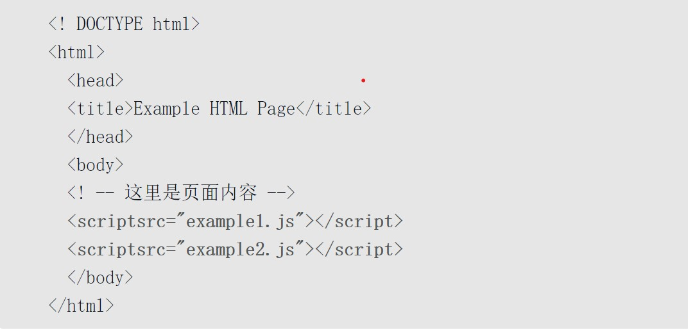
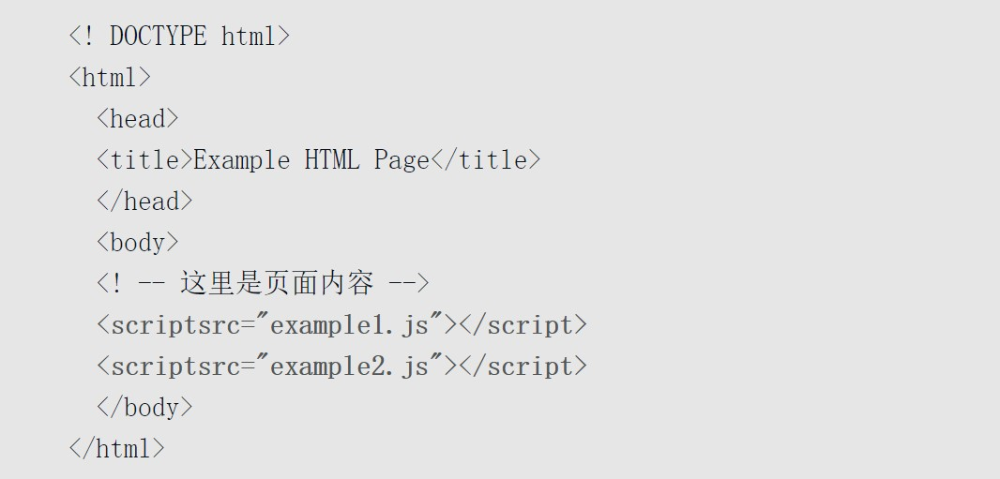
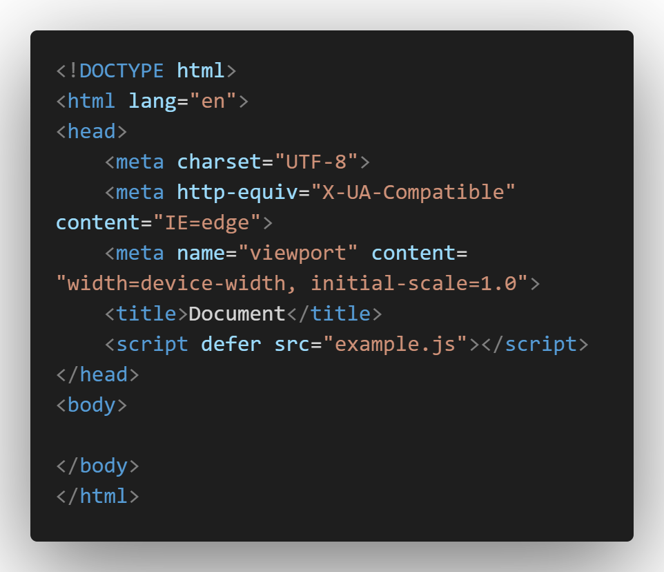

[toc]

# 前言


听说大厂比较看重js掌握的好不好, 所以我翻起了俺们亲爱的,相爱的,深爱的,敬爱的"JavaScript高级程序设计"

读完这本书希望自己的js技术能变得"高级"起来

本文写下来主要是巩固自己的学习经历, 并在未来需要的时候再翻阅

为了未来翻阅, 我会做到极尽的详细


----------------

# 一. 什么是JavaScript

## 小结
JavaScript是一门用来与网页交互的脚本语言，包含以下三个组成部分。

1. ECMAScript: 

    由ECMA-262定义并提供核心功能

2. 文档对象模型（DOM）：

    提供与网页内容交互的方法和接口。

3. 浏览器对象模型（BOM）：

    提供与浏览器交互的方法和接口。


其实就是这本书大概就是从ECMAScript开始讲

先讲讲基础语法, 然后BOM和DOM, 其中又有细分

然后再讲点其他的东西

大概就是这么回事, 好了, 我真刻苦读书, 俺去打把星际争霸, 欸就是那么突然, 还没开始就结束了


**19:07**

--------------
**19:51**

```
喊了半天突残求带突残求带没人理我啊我丢
```


# 二. HTML中的JavaScript

## 2.0 本章内容

1. 使用\<script\>元素 
2. 行内脚本与外部脚本的比较
3. 文档模式对JavaScript有什么影响
4. 确保JavaScript不可用时的用户体验 


## 2.1 script元素

将JavaScript插入HTML的主要方法是使用\<script\>元素
\<script\>具有以下八个属性:(看看就行)

```
1. src: 可选
    表示包含要执行的代码的外部文件。 
```

```
2. charset: 可选
    使用src属性指定的代码字符集。
    这个属性很少使用，因为大多数浏览器不在乎它的值
```

```
3. crossorigin：可选
    配置相关请求的CORS（跨源资源共享）设置。
    默认不使用CORS。crossorigin="anonymous"配置文件请求不必设置凭据标志。
    crossorigin="use-credentials"设置凭据标志，意味着出站请求会包含凭据。
```

```
4. defer：可选
    表示脚本可以延迟到文档完全被解析和显示之后再执行。
    只对外部脚本文件有效。在IE7及更早的版本中，对行内脚本也可以指定这个属性。
```
```

5. integrity：可选
    允许比对接收到的资源和指定的加密签名以验证子资源完整性（SRI, Subresource Integrity）。
    如果接收到的资源的签名与这个属性指定的签名不匹配，则页面会报错，脚本不会执行。
    这个属性可以用于确保内容分发网络（CDN, Content Delivery Network）不会提供恶意内容。

```
```

6. async : 可选
    表示应该立即开始下载脚本，但不能阻止其他页面动作，比如下载资源或等待其他脚本加载。
    只对外部脚本文件有效。

```
```

7. type：可选。
    表示代码块中脚本语言的内容类型（也称MIME类型）。
    按照惯例，这个值始终都是"text/javascript"，
    尽管"text/javascript"和"text/ecmascript"都已经废弃了。
    JavaScript文件的MIME类型通常是"application/x-javascript"，不过给type属性这个值有可能导致脚本被忽略。
    在非IE的浏览器中有效的其他值还有"application/javascript"和"application/ecmascript"。
    如果这个值是module，则代码会被当成ES6模块，而且只有这时候代码中才能出现import和export关键字。

```
```

8. language: 已经废弃
    已经被type代替了
```

-----------------

**使用\<script\>的方法**
1. 通过它直接在网页中嵌入JavaScript代码
```html
<script>
    这里面写JavaScript代码
    包含在<script>内的代码会被从上到下解释。

    // 注意这里不要出现'</script>'如:
    // console.log("</script>");
    // 如果出现这样的写法, 会被认为在这里结束script

    可以使用转义字符解决上述问题
    console.log('<\/script>');
</script>
```

2. 以及通过它在网页中包含外部JavaScript文件。

```html
<script src-"这里填写js文件的路径"></script>

<!-- 在xhtml中可以忽略结束标签 -->
<!-- <script src-"这里填写js文件的路径"> -->


<!-- 
    注意使用src引入外部js的script标签不要再写js代码，否则只下载外部js文件而不执行行内js代码 
-->
<script src='./example.js'>
    // 这里面的代码不会被执行
    console.log('hello js!')
</script>


```


**注意**

注意 按照惯例，外部JavaScript文件的扩展名是．js。
这不是必需的，因为浏览器不会检查所包含JavaScript文件的扩展名。
这就为使用服务器端脚本语言动态生成JavaScript代码，
或者在浏览器中将JavaScript扩展语言（如TypeScript，或React的JSX）转译为JavaScript提供了可能性。
不过要注意，服务器经常会根据文件扩展来确定响应的正确MIME类型。
如果不打算使用．js扩展名，一定要确保服务器能返回正确的MIME类型。

MIME类型也就是媒体类型， 如文本， 音频， 视频


```html
<script src="./example.js"></script>

```
浏览器在解析这个资源时，会向src属性指定的路径发送一个GET请求，以取得相应资源，
假定是一个JavaScript文件。
这个初始的请求不受浏览器同源策略限制，但返回并被执行的JavaScript则受限制。
当然，这个请求仍然受父页面HTTP/HTTPS协议的限制。(看看就行)

来自外部域的代码会被当成加载它的页面的一部分来加载和解释。
这个能力可以让我们通过不同的域分发JavaScript。(如DNS引入)
不过，引用了放在别人服务器上的JavaScript文件时要格外小心，
因为恶意的程序员随时可能替换这个文件。(确实恶心)

在包含外部域的JavaScript文件时，
要确保该域是自己所有的，
或者该域是一个可信的来源

\<script\>标签的integrity属性是防范这种问题的一个武器，
但这个属性也不是所有浏览器都支持。

```
integrity：可选
    允许比对接收到的资源和指定的加密签名以验证子资源完整性（SRI, Subresource Integrity）。
    如果接收到的资源的签名与这个属性指定的签名不匹配，则页面会报错，脚本不会执行。
    这个属性可以用于确保内容分发网络（CDN, Content Delivery Network）不会提供恶意内容。

```

### 2.1.1 标签位置

过去所有script元素多方在head里

**目的**:
将外部css与js放在一起
**缺点**:由于页面在浏览器读取到body才开始渲染, 这就需要把外部的js全部下载好之后才开始渲染, 导致可能会有一段时间页面完全空白(正在下载js)

**解决方式**: 将script标签放在body最后面

这样直接渲染页面再下载js, 缩短了空白时间

### 2.1.2 推迟执行脚本
HTML 4.01为\<script\>元素定义了一个叫defer的属性
**属性作用**:表示脚本在执行的时候不会改变页面的结构, 即脚本会被延迟到整个页面都解析完毕后再运行.

虽然这里script标签在head标签中,
但是当浏览器解析到<\/html\>时, 脚本才会按其出现顺序执行(多个脚本时),并且会在DOMContentLoaded事件之前执行,
在实际当中，推迟执行的脚本不一定总会按顺序执行或者在DOMContentLoaded事件之前执行，因此最好只包含一个这样的脚本。


### 2.1.3 异步执行脚本

async属性:
立即开始下载, 但不阻止其他脚本下载或执行, 无法保证脚本按标签顺序执行, 也不必等到脚本下载完再加载页面
因此, 异步脚本不应该在加载期间修改dom
实践中不推荐使用

### 2.1.4 动态加载脚本

使用DOM API, 添加节点到文档当中, 并引入脚本文件
这具体操作在学完dom之后就会了这里不演示

动态加载的js脚本对浏览器的预加载器是不可见的
这可能影响性能, 可以添加如下代码让预加载器知道可能加载到界面的脚本文件:
```JavaScript
<link rel="preload" href="someJsFile.js">

```


### 2.1.5 XHTML中的变化

XHTML: 可扩展超文本标记语言
作用: 将html作为xml重新包装的结果
注意: script标签在xhtml中必须type属性且值为"text/javascript"
介绍原因: xhtml虽然已经退出历史舞台, 但在实践中可能遇到遗留代码

xhtml编写代码的规则比html更为严格, 如下在html有效但是在xhtml无效
```html
<script type="text/javascript">
    // ...
    if(a < b){
        // ...
    }
    // ...

</script>
```
原因: a\<b中的\<会被认为是标签开始, 并且标签开始后不能接空格所以出错
两种解决方法:
1. 将小于号替换成html实体形式(&lt;)

```html
<script type="text/javascript">
    if(a&lt;b){
        // ...
    }
</script>

```
缺点: 增加了阅读代码的难度

2. 将所有代码放入CDATA块中

```    
CDATA块:
表示文档中可以包含任意文本的区块，
其内容不作为标签来解析，
因此可以在其中包含任意字符，
包括小于号，并且不会引发语法错误
```

代码如下:
```html
<script type="text/javascript"><![CDATA[

    if(a<b){
        // ...
    }

]]></script>

```
这样似乎解决了问题, 但是在不支持CDATA块的浏览器非XHTML兼容浏览器中则不行
为此, CDATA必须使用注释来抵消
```html
<script type="text/javascript">
// <![CDATA[

    if(a<b){
        // ...
    }

// ]]>
</script>

```

```
这种格式适用于所有现代浏览器。
它可以通过XHTML验证，
且对XHTML之前的浏览器也能优雅地降级。
```

**注意** XHTML模式会在页面的MIME类型被指定为"application/xhtml+xml"时触发。并不是所有浏览器都支持以这种方式送达的XHTML

2.1.6 废弃的语法

除非使用xhtml或者包含非JavaScript代码, 否则最好不指定type


## 2.2 行内代码与外部文件

可以在html文件中直接嵌入js代码
但实践中一般建议尽可能地将js代码放入外部文件中(非强制,非明确的规则)
理由如下:
1. **可维护性**

js代码分布到各个文件, 很难维护, 如果集中起来放入一个专门存放js文件的地方, 维护性将大大提高

2. **缓存**

浏览器会根据特定的设置缓存所有外部链接的JavaScript文件，也就是说如果两个页面都用到同一个文件，则该文件只需下载一次。这使得页面加载更快。


3. **适应未来**

通过把JavaScript放到外部文件中，就不必考虑用XHTML或前面提到的注释黑科技。包含外部JavaScript文件的语法在HTML和XHTML中是一样的。(xhtml现在不用了, 所以叫适应未来, 感觉有点牵强)

**配置浏览器请求外部文件**
重点考虑它们会占用多少带宽。
SPDY/HTTP2中，预请求的消耗已显著降低，
以**轻量、独立**JavaScript组件形式向客户端送达脚本更具优势。

例如
一个页面使用了引入了三个js文件example1.js, example2.js, example3.js,
另一个页面也引入三个js文件example3.js,example4.js,example5.js,
在初次请求时，如果浏览器支持SPDY/HTTP2，就可以从同一个地方取得一批文件，并将它们逐个放到浏览器缓存中
从浏览器角度看，通过SPDY/HTTP2获取所有这些独立的资源与获取一个大JavaScript文件的延迟差不多(即获取一个大的js文件与获取由这个大js文件拆分成若干小js文件所需要的时间差不多)
这里第二个页面也用到了example3.js, 那么它可以直接从浏览器缓存中得到, 就不需要再等待加载

```
有点按需加载的意思
将一个大的js文件分割成许多小的js文件
原来大的js文件中某个或某些方法可能要在多个页面上重复使用, 
那么就需要将这个js文件整个导入,
而分割成小的js文件后则只需要按照需求导入小的js文件而不必整个大的文件全部导入
比如一些库, 如果不拆分成小文件, 那么可能这个库有几十上百MB, 全部导入显然是不现实的

我刚学的时候想着, 直接全部都导入然后随便用岂不是更爽? 
但是网页如果导入一个50MB的依赖, 可能快的几秒, 慢的十几秒
就算网速很快, 要你在一个页面等待3s, 
我想大多数人都已经开始认为是不是自己的网出问题了, 
根本没有耐心等3s好吧

所以我感觉吧, 应该先加载页面需要的那部分, 
然后等页面渲染完了,脚本也调用完了,
再加载preload那部分的js, 
那么如果用户打开新的页面中如果有其他没有缓存的js文件, 
也可能在用户浏览上一个页面的空闲时候被后台下载完

不知道现在是不是这样的还是有更高级的做法, 
或者说这个想法根本不切实际, 无法实现
(我个小菜比, 狗头保命!)
```


## 2.3 文档类型说明


在 HTML 中，文档类型 doctype 的声明是必要的。
在所有文档的头部，你都将会看到"**<\!DOCTYPE html>**" 的身影。
这个声明的目的是防止浏览器在渲染文档时，切换到我们称为“怪异模式(兼容模式)”的渲染模式。
“<\!DOCTYPE html>" 确保浏览器按照最佳的相关规范进行渲染，而不是使用一个不符合规范的渲染模式。

### 2.3.1 三种文档模式
目前浏览器的排版引擎使用三种模式：
怪异模式（Quirks mode）、
接近标准模式（Almost standards mode）、
标准模式（Standards mode）。

在怪异模式下，排版会模拟 Navigator 4 与 Internet Explorer 5 的非标准行为。
为了支持在网络标准被广泛采用前，就已经建好的网站，这么做是必要的。
在标准模式下，行为即（但愿如此）由 HTML 与 CSS 的规范描述的行为。
在接近标准模式下，只有少数的怪异行为被实现。

```
在很久以前的网络上，页面通常有两种版本：
为网景（Netscape）的 Navigator 准备的版本，
以及为微软（Microsoft）的 Internet Explorer 准备的版本。

当 W3C 创立网络标准后，为了不破坏当时既有的网站，浏览器不能直接弃用这些标准。
因此，浏览器采用了两种模式，用以把能符合新规范的网站和老旧网站区分开。
```


### 2.3.2 浏览器如何决定使用哪个模式?

对 HTML 文件来说，浏览器使用文件开头的 DOCTYPE 来决定用怪异模式处理或标准模式处理
为了确保你的页面使用标准模式，请确认你的页面如同本范例一样拥有 DOCTYPE:
```html
<!DOCTYPE html>
<html>
  <head>
    <meta charset=UTF-8>
    <title>Hello World!</title>
  </head>
  <body>
  </body>
</html>
```

<\!DOCTYPE html>是最简单而且推荐的方式
请确定你把 DOCTYPE 正确地置于 HTML 文件的顶端。
如果有任何其他字符位于 DOCTYPE 之前，比如注释或 XML 声明，
会导致 Internet Explorer 9 或更早期的浏览器触发怪异模式。

在 HTML5 中，DOCTYPE 唯一的作用是启用标准模式。
更早期的 HTML 标准中，DOCTYPE 会附加其他意义，
但没有任何浏览器会将 DOCTYPE 用于怪异模式和标准模式之间互换以外的用途。


## 2.4 noscript元素

针对早期浏览器不支持js的问题, 需要一个页面优雅降级的处理方案
虽然现金的浏览器已经100%支持js, 但对于禁用js的浏览器来说, 这个元素仍然有用

noscript可以出现在除了script以外的body中的任何html元素
浏览器将显示包含在noscript中的内容的两种情况:
1. 浏览器不支持脚本
2. 浏览器对脚本的支持被关闭

上面两个任何一个条件被满足, 包含在noscript中的内容就会被渲染, 否则浏览器不会渲染noscript中的元素

可以在脚本不可使用的时候使用这个让浏览器显示出一段话提示用户浏览器不支持js


# 第三章 语言基础

## 3.0 本章内容

* 语法
* 数据类型
* 流控制语句
* 理解函数

(基于ECMAScript第六版)


## 3.1 语法

### 3.1.1 区分大小写

变量, 函数名, 操作符都区分大小写
如test与Test是两个不同的变量

类似的typeof不能作为函数名(关键字)
但是Typeof是一个有效的函数名

3.1.2 标识符

**定义**: 变量, 函数, 属性或函数参数的名称
**组成**: 
1. 第一个字符必须是一个**字母**或**下划线**或**美元符号**
2. 剩下的字符可以是字母,下划线,美元符号或数字

标识符中的字母可以是拓展ASCII中的字母也可以是Unicode的字母字符, 如À和Æ（但不推荐使用）

标识符形式: 使用驼峰大小写形式(第一个单词首字母小写其他后面每个单词的首字母大写如: somethingLikeThis)

非强制, 但因为这种形式跟ECMAScript内置函数和对象的命名方式一致, 故推荐(最佳实践)
```
注意:
关键字, 保留字, true, false和null不能作为标识符
```

### 3.1.3 注释

1. 单行注释
```JavaScript
// 这是单行注释
```


2. 多行注释

```JavaScript
/*
    这
    是
    多
    行
    注
    释
*/

```

### 3.1.4 严格模式

ECMAScript5 增加了严格模式
严格模式是一种不同的JavaScript解析和执行模型，
ECMAScript 3的一些不规范写法在这种模式下会被处理，
对于不安全的活动将抛出错误。

要对整个脚本启用严格模式，在脚本开头加上这一行：
```JavaScript
"use strict"
```
这个一个预处理指令
任何支持的JavaScript引擎看到它都会切换到严格模式。
选择这种语法形式的目的是不破坏ECMAScript 3语法

也可以单独指定一个函数在严格模式下执行, 将上面这句话放到函数体的开头即可:
```JavaScript
function demo(){
    "use strict";
    // ...
}
```

### 3.1.5语句

JavaScript中语句可以不加分号:
```JavaScript
let a = 100 + 200   // 有效但不推荐
let b = a + 1000;   // 加分号也有效, 推荐
```
不加分号则由解析器确定语句结尾, 而加分号自己确定, 
避免省略造成的问题(如输入内容不完整)
加分号便于开发者删除空行来压缩代码(没有分号只删除空行的化会导致语法错误)
加分号也有助于在某些情况下提升性能，因为解析器会尝试在合适的位置补上分号以纠正语法错误。
要养成加分号的好习惯

**代码块**
多条语句可以合并到一个c语言风格的代码块之中
代码块{}, 左花括号开始, 右花括号结束
```JavaScript
if(test){
    // ...
}

```
建议始终在控制语句中使用代码块, 即使例如if中只有一条语句可以省略{}


## 3.2 关键字与保留字

ECMA-262 描述了一组保留的**关键字**
这些关键字有特殊的用途, 不能用作标识符或属性名
ECMA-262第六版规定的所有关键字如下
```
break           do  
in              typeof
case            else
instanceof      var
catch           export
new             void
class           extends
return          while
const           finally
super           with
continue        for
switch          yield
debugger        function
this            default
if              throw
delete          import
try  
```

还描述了一组未来的保留字
同样不能用作标识符或属性名, 他们在语言中没有特定用途
但是他们是保留给将来做关键字用的

```
始终保留:
enum
严格模式下保留:
implements          package
public              interface
protected           static
let                 private
模块代码中保留:
await(现在好像有async/await)
```
这些词汇不能作为标识符
但是目前还可以用作对象的属性名
不建议使用关键字和保留字作为标识符和属性名

## 3.3 变量


