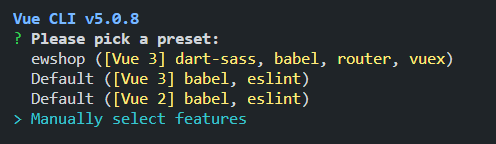
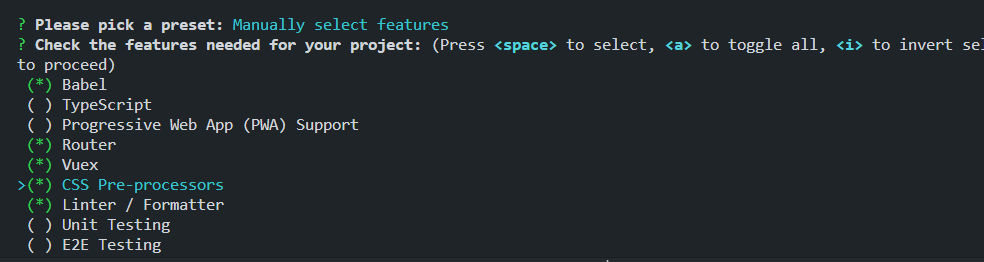
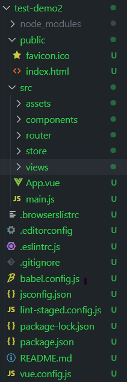

# 1 vue-cli
是官方提供的脚手架工具

是利用webpack管理vue

# 2 安装
```
npm install -g @vue/cli
```

# 3 检查版本
```
npm list -g

或

vue --version

或

vue -V
```

# 4 创建项目
```
vue create ProjectName

ProjectName: 自己定义的项目名称
```

# 5 测试创建vue3项目默认配置
```
vue create test-demo
```

# 6 自己选择项目配置
```
vue create test-demo2
```


到达如下页面, 上下控制, 空格选中/取消


```
后续流程

选择3.x

Use history mode for router?
路由是否选择历史模式?   yes

选择sass/scss-with dart-sass(less也可以)

选择eslint查错标准规范

只检查语法还是检查语法且修复(都选上也可以)

Where do you prefer placing config for Babel, ESLint, etc.?
把babel这些插件的配置文件放哪里? 单独放或者一起放package.json里

Save this as a preset for future projects?
保存配置清单?可以在以后直接选择这个清单就达到刚才一样的项目配置
```

# 7 查看目录结构

## 7.1public
放一些特殊的公共资源
如整个项目的图标, 整个页面的依赖模板(webpack打包依赖模板)等

## 7.2 src
放一些源码资源
### 7.2.1 assets
放一些资源, 如图片,音频, 视频等

### 7.2.2 components
vue是组件化的
一些可以复用的小组件等放在这里

比如说为按钮写了一个样式,将他作为一个组件
然后后面可以复用, 再引入一次就行了

### 7.2.3 router
存放路由文件

### 7.2.4 store
放vuex的配置以及处理等
### 7.2.5 views
放页面级别的组件, 一个页面可能放很多小组件

比如说一个网站的主页面, 个人页面, 商店页面等
## 7.3 根目录下其他文件
一般放该项目的配置文件
如
```
package.json
package-lock.json
vue.config.js
...
```

