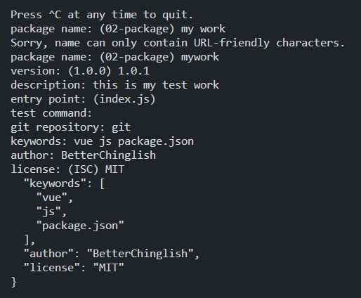

# cmd路径设置到当前文件夹下
cd "02 package文件"

# 初始化文件夹
npm init -y


# 查看package.json文件
此时已经自动生成package.json文件

这是-y直接默认生成的(--yes)

# 自定义初始化文件夹
删除刚才自动生成的package.json

使用npm init


```json
{
// 项目名称
  "name": "mywork",
//   版本号
  "version": "1.0.1",
// 描述文本
  "description": "this is my test work",
//  主入口文件
  "main": "index.js",

// 一些脚本命令
  "scripts": {
    // 这里使用npm run test
    "test": "echo \"Error: no test specified\" && exit 1"
  },
// 存储仓库
  "repository": {
    // 仓库类型, 这里是git
    "type": "git",
    // 仓库链接
    "url": "git"
  },
//   关键词
  "keywords": [
    "vue",
    "js",
    "package.json"
  ],
//   作者
  "author": "BetterChinglish",
//   开源协议
  "license": "MIT"
}
```

# 安装jquery
npm i jquery -save

```json
{
  "name": "mywork",
  "version": "1.0.1",
  "description": "this is my test work",
  "main": "index.js",
  "scripts": {
    "test": "echo \"Error: no test specified\" && exit 1"
  },
  "repository": {
    "type": "git",
    "url": "git"
  },
  "keywords": [
    "vue",
    "js",
    "package.json"
  ],
  "author": "BetterChinglish",
  "license": "MIT",
//   多了一个运行时依赖
  "dependencies": {
    "jquery": "^3.6.1"
  }
}
```

# 安装bootstrap
npm i bootstrap -save-dev
显然这是一个开发时依赖

```json
{
  "name": "mywork",
  "version": "1.0.1",
  "description": "this is my test work",
  "main": "index.js",
  "scripts": {
    "test": "echo \"Error: no test specified\" && exit 1"
  },
  "repository": {
    "type": "git",
    "url": "git"
  },
  "keywords": [
    "vue",
    "js",
    "package.json"
  ],
  "author": "BetterChinglish",
  "license": "MIT",
  "dependencies": {
    "jquery": "^3.6.1"
  },
//   多了一个开发时依赖, develop dependence
  "devDependencies": {
    "bootstrap": "^5.2.2"
  }
}
```


# package.json文件的作用
```
项目发给别人或者上传到网络上时
不需要把这些jquery这些辅助开发的工具也同时发给别人
只需要有个package.json文件记录需要哪些依赖工具即可

这样项目到别人手里只需要
cd到当前目录
npm install
即可自动安装这些依赖
```
上面的
    "jquery": "^3.6.1"
    "bootstrap": "^5.2.2"
都有^这个符号

^表示后面这个大版本不动, 其他按最大的来更新
    这里是3和5

如果是~, 则表示将最后一位版本更新到最新
如~3.6.1, 3和6不动, 最后一位更新到最新

如果这两个符号都没有, 如3.4.2, 则指定了安装版本为3.4.2

# 如何使用导入的包?

```js
// JavaScript
let $ = require('jquery');      // 这里写入包名即可
```

js可以将数据作为模块暴露

```js
// export.js
module.export = [1,2,3,4,5];
```

```js
// require.js
let nums = require('./export.js');
console.log(nums);
```