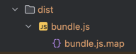
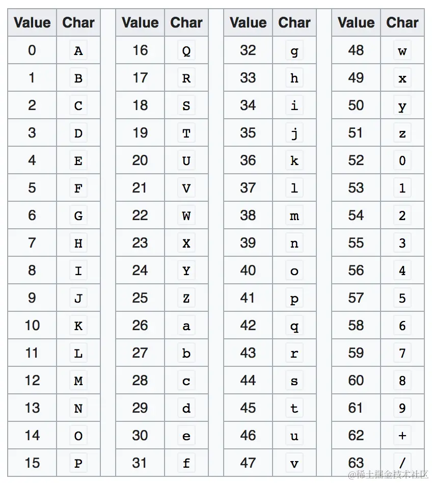

# 使用

详见 [js的模块化-webpack打包示例](https://github.com/BetterChinglish/Knowledge/tree/Qsj/17%20webpack/01%20js%E7%9A%84%E6%A8%A1%E5%9D%97%E5%8C%96/test)

# 配置

```js

const { resolve } = require('path')

module.exports = {
  mode: 'development',
  devtool: 'source-map',
  entry: './src/index.js',
  output: {
    path: resolve(__dirname, 'dist'),
    filename: "bundle.js"
  }
}
```

devtool有很多类型，这里可以看看source-map

详细情况可以看官网的取值

打包后，可以看到bundle.js与bundle.js.map文件



可以看到bundle.js中

```js
/******/ (() => { // webpackBootstrap
/*!**********************!*\
  !*** ./src/index.js ***!
  \**********************/
console.log('hello webpack')
/******/ })()
;
//# sourceMappingURL=bundle.js.map
```

最后一行指明了当前打包后的文件对应的sourceMap文件

# source map文件含义

查看bundle.js.map

```json
{
    "version": 3,
    "file": "bundle.js",
    "mappings": ";;;;AAAA,4B",
    "sources": [
        "webpack://test/./src/index.js"
    ],
    "sourcesContent": [
        "console.log('hello webpack')"
    ],
    "names": [],
    "sourceRoot": ""
}
```

* version: source map的版本
* file: 打包后的的文件
* mappings：代码位置映射
* sources：原文件路径
* sourcesContent：对应源码的内容
* names：源码中的变量名
* sourceRoot：源码根目录

# mappings原理

## 初步设计

若原文件source.txt只有一行‘hello world’被打包成了bundle.txt也只有一行‘world hello’，如何映射二者关系？

### 一一映射

很简单的思路，原‘hello world’的 ‘h’ 在第1行第1列，则记作 （1，1）

打包后变成了‘world hello’，h则第1行第7列，则记作（1，7）

| 原字符串                         | h   | e   | l   | l    | o    |     | w   | o   | r   | l    | d    |
| -------------------------------- | --- | --- | --- | ---- | ---- | --- | --- | --- | --- | ---- | ---- |
| 原坐标                           | 1,1 | 1,2 | 1,3 | 1,4  | 1,5  | 1,6 | 1,7 | 1,8 | 1,9 | 1,10 | 1,11 |
| 打包后字符串                     | w   | o   | r   | l    | d    |     | h   | e   | l   | l    | o    |
| 原字符串对应打包后的字符串的位置 | 1,7 | 1,8 | 1,9 | 1,10 | 1,11 | 1,6 | 1,1 | 1,2 | 1,3 | 1,4  | 1,5  |

我们写作

1，7，source.txt，1，1

打包后行列，原文件名，对应原文件行列


### 省略行号

再参考一下打包后的文件：

```js
/******/ (() => { // webpackBootstrap
/*!**********************!*\
  !*** ./src/index.js ***!
  \**********************/
console.log('hello webpack')
/******/ })()
;
//# sourceMappingURL=bundle.js.map
```

其对应的mappings是;;;;AAAA,4B

那么分号是什么意思呢？其实就是换行，代码中第五行才是真实代码，所以需要换四行，即四个分号

参考这个思路，我们打包后的文件的行号可以省略使用分号表示即可，以打包后的文件为视角，有效代码则映射到原代码中，打包后的文件中遇到换行则使用分号代替

即原来的：**1，7，source.txt，1，1**可以表示为**7, source.txt, 1,1 （因为第一行就是代码，无需使用换行的分号）**

### 省略文件名

source.txt也可以优化，即用sources数组存放原文件名，使用index表示位置

则**7, source.txt, 1,1**可以表示为**7, 0, 1,1**

同理**1，8，source.txt，1，2**可以表示为**8，0，1,2**


### 使用分词

代码中通常都是一个词一个词的，就如hello world映射world hello，应该是hello整个词的位置发生改变

hello world -> world hello

1,1, source.txt, 1,7 -------- 打包后world单词位置（1，1），原代码文件名，原代码world起始位置（1，7）

1,7, source.txt, 1,1---------打包后hello单词位置（7，1），原代码文件名，原代码hello起始位置（1，1）

我们可以使用数组names来存放分词

再按照之前思路----当前行用分号表示，只看当前行的第几列，源文件使用sources数组存放

```js
sources: ['source.txt']
names:['hello', 'world']

'hello world' -> 'world hello'

world:
1,0,1,7,1: 
	1 - 当前打包后的文件的第一列的单词，
	0 - 原文件中sources数组中的位置，即原文件名 = sources[0] = 'source.txt'
	1 - 对应原文件第几行
	7 - 对应原文件第几列
	1 - 对应单词为names数组下标为1的单词，即names[1] = 'world'
hello:
7,0,1,1,0：...
```

练习：

```js
'hello wang ma zi' -> 'hello ma zi wang'  (sayHello.js) -> (bundle.js)
names: ['hello', 'wang', 'ma', 'zi']
sources: ['sayHello.js']
则bundle.js中的王应该如何表示？

wang的w处于bundle.js的第1行第13列（1，13）
原文件名在sources数组的下标为0，
对应原文件的坐标为第1行第7列（1，7）
wang对应names中的下标1
则应该为13,0,1,7,1
```


### 使用相对位置

从刚才的练习中不难看出，随着字符串增长，第一个数字也会增长(13, 0, 1, 7, 1)

若练习中的字符串再长一些，例如:


```js
'hello wang ma zi ni hao a chi fan le ma' -> 'hello ma zi wang ni hao a fan chi le ma'  (sayHello.js) -> (bundle.js)
names: ['hello', 'wang', 'ma', 'zi', 'ni', 'hao', 'a', 'chi', 'fan', 'le', 'ma']
sources: ['sayHello.js']

则对于fan应该是：1，27，0, 1, 31, 8 -> 27, 0, 1, 31, 8
```

由此可见，随着数字越来越大，则越不便保存

我们可以考虑使用前一个分词的相对位置进行保存

对于上述hello，列位置是1，则下一个分词ma对于hello，应该是增长了6

即hello的h往右挪6个即为ma的m

回到最初的例子

```js
sources: ['source.txt']
names:['hello', 'world']

'hello world' -> 'world hello'

world:
1,0,1,7,1: 
	1 - 当前打包后的文件的第一列的单词，
	0 - 原文件中sources数组中的位置，即原文件名 = sources[0] = 'source.txt'
	1 - 对应原文件第几行
	7 - 对应原文件第几列
	1 - 对应单词为names数组下标为1的单词，即names[1] = 'world'

hello:
不使用相对位置：7,0,1,1,0
使用相对位置: 6,0,1,1,0
```

则我们第一个数字其实表示的就是当前单词的首字母对上一个单词的首字母的偏移量了


### 使用VLQ编码

分析一下我们这五个位置

* 第一个位置是偏移量，一般单词不会很长，则第一个位置上的数不会很大
* 第二个位置上源文件名在sources数组中的下标，原文件可能很多，这个数字可能会比较大
* 第三个位置表示源文件行数，这个位置可能极大，一些大文件可能几千行
* 第四个位置表示源文件某行的第几列，一般写代码也不会一行写太多‘
* 第五个位置则为变量名下标，也有可能很大

那么对于这几个可能很大的数字，我们应该如何表示呢？尤其是第三个位置

我们可以使用VLQ编码

例如数字1，23，456，7，8

我们使用比特组来表示这些数字，一个比特组有六位

| 6                      | 5            | 4            | 3          | 2          | 1                          |
| ---------------------- | ------------ | ------------ | ---------- | ---------- | -------------------------- |
| 是否连续，1连续0不连续 | 表示数字大小 | 表示数字大小 | 表示数字大 | 表示数字大 | 表示数字正负，1负数，0正数 |

对于数字1

```
转为二进制则为1，一个比特组中间四个bit表示数字，填入1，则为0001

由于只有一个数字，当然与后面的23不连续，则第六位填入0，为正数，第一位填入0

则转为000010
```


对于 数字23，需要使用两个比特组，第二个比特组开始已经不需要符号位，可以将符号为作为保存数据使用

```
二进制表示为10111，而一个比特组表示数字的位数只有四位，则需要两个比特组

则将其拆为 1 0111，将0111放入第一个比特组，1放入第二个

第一个比特组，应该表示连续，则第六位是1，正数，第一位为0
则为101110

这种情况第二个比特组比较特殊，已经不需要符号位，因为23第一个比特组就已经表示了这个数字是正数
则第二个比特组的第一个比特也用来表示数据，第六个比特应该表示与后面的456不连续，使用0
即应该表示为000001

即最终表示为 101110 000001
```


同理，对于数字456

```
456的二进制：111001000
9位，第一个比特组4位，第二个及以后都是五位表示数据，则只需要两个比特组
第一个比特组表连续与正数，第二个表终止即不连续，
则：110000 011100
```

最终：**1，23，456，7，8**应该表示为：

```
000010 101110 000001 110000 011100 001110 010000
```

最后转成十进制再对应base64编码

```
十进制：2 46 1 48 28 14 16
base64编码：CuBwcOQ
```


