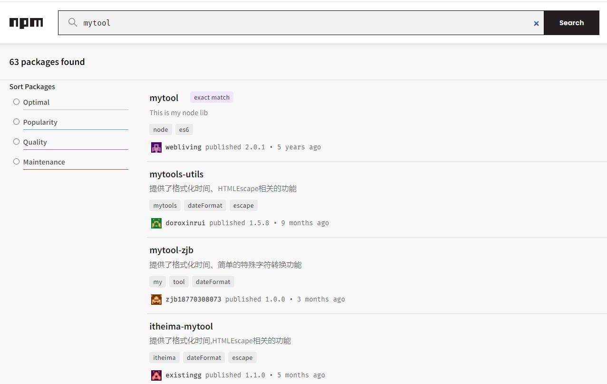
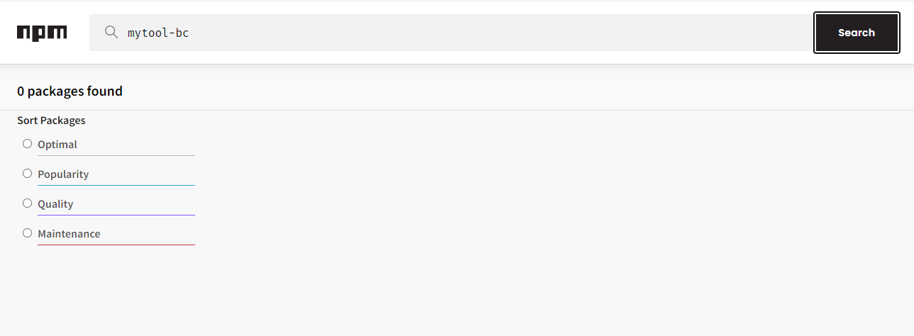

## 包的编写
### 创建文件夹
myTool

### 初始化
```
cd ./myTool
npm init -y
```

### 查看myTool文件夹
发现多了个package.json文件
```json
{
  "name": "mytool",
  "version": "1.0.0",
  "description": "",
  "main": "index.js",
  "scripts": {
    "test": "echo \"Error: no test specified\" && exit 1"
  },
  "keywords": [],
  "author": "",
  "license": "ISC"
}
```

#### name
表示你要把发布的包名称, 例如npm i axios中的axios就是包名, 需要唯一, 可以去npm官网搜一下是否有该名称, 如果有记得修改


#### version
版本号

#### description
对于该包的描述

#### main
主入口文件, 当别人下载你的包使用时, 是直接require('mytool')这样, 这只到了你的文件夹mytool下, 然后自动根据package中的main寻找你的暴露的函数

#### keywords
描述你的包的关键词

#### license
开源协议

### 确定唯一包名

发现该包名已经存在, 修改为mytool-bc, 再次查找

发现没有人发布包名为mytool-bc的包, 故可以使用
同时修改文件夹myTool为mytool-bc, 保持一致（最好一开始就确认）

### 确定主入口文件
默认为 *"main": "index.js"*
```json
{
  "name": "mytool-bc",
  "version": "1.0.0",
  "description": "",
  "main": "index.js",
  "scripts": {
    "test": "echo \"Error: no test specified\" && exit 1"
  },
  "keywords": [],
  "author": "",
  "license": "ISC"
}
```

故创建 *mytool-bc/index.js* 文件

### 模块化分文件编写
当该包有很多功能时，可以将功能函数单独在一个文件夹或一个文件中编写
然后暴露出去后再在入口文件中引入并暴露

下面将举例说明

### 模块编写
只使用简单例子说明
创建文件夹 *mytool-bc/src*
创建文件 *mytool-bc/src/sayhello.js* 和 *mytool-bc/src/saygoodbye.js*
```js
// sayhello.js
function sayhello(name) {
    console.log('hello! ' + name);
}

module.exports = {
    sayhello
}
```

```js
// saygoodbye.js
function saygoodbye(name) {
    console.log('goodbye! ' + name);
}

module.exports = {
    saygoodbye
}
```
### 主入口文件
```js
// 主入口文件
const goodbye = require('./src/saygoodbye');
const hello = require('./src/sayhello')

module.exports = {
    ...goodbye,
    ...hello,
}
```

### 使用测试
创建 *test.js* (与mytool-bc同级)
```js
const {sayhello,  saygoodbye} = require('./mytool-bc')

sayhello('张三')
saygoodbye('张三');
```

```
node test.js
```
成功输出: 
>hello! 张三
goodbye! 张三

### 编写文档
创建 *mytool-bc/README.md*
在其中介绍包括但不限于
> 如何安装使用包
> 包的描述
> 不同模块的使用方法以及注意事项
> 遵守的协议


[README.md](./mytool-bc/README.md)


## 包的上传

### 注册
去npm官网注册账号
记住账户, 登录密码, 注册邮箱

### 确认使用npm
如果切换了淘宝镜像这些记得切回npm
不记得切过没有自己可以查查百度怎么确认, 这里不赘述
如果使用nrm的则用以下命令确认:
```
nrm current
```


### 登录
终端输出
```
npm login
```
输出注册时的账号,密码,注册邮箱
可能会发个验证码给你的邮箱, 登录邮箱查看然后输入即可
> 注意输出密码的时候是不会显示你输入的长度的, 和linux登录账户差不多

### 发布
```
npm publish
```
发布成功后可以打开网页在npm官网查看(packages选项下)

### 删除
只能删除72h内的包, 且删除后24h不允许重复发布
```
npm unpublish package_name --force
```

尽量不要发布没有意义的包, 只是学习测试使用的话发布完记得删除


## 模块的加载机制

## 优先从缓存中加载
require一个模块会执行该模块的代码
**模块第一次被require后会被缓存**
多次调用require()不会导致模块的代码被执行多次, 
都优先从缓存中加载, 以提高模块的加载效率


## 内置模块的加载机制
内置模块指node.js官方提供的,node.js自带的模块
其加载的优先级最高
这意味着如果你的模块或第三方模块和内置模块同名, 优先加载内置模块

## 自定义模块的加载机制
使用require()加载自定义模块时, 必须指定以./或../开头的路径标识符
否则node会将其当作内置模块或者第三方模块进行加载

如果require()导入自定义模块时你省略了文件的扩展名
则按照以下顺序尝试加载:
```
1 按照确切的文件名进行加载
2 补全 .js
3 补全 .json
4 补全 .node
5 加载失败, 报错
```
## 第三方模块的加载机制
如果require()的不是一个内置模块, 且没有以./或../开头
则作为第三方模块加载, 尝试从当前模块的父目录下的/node_modules文件夹中寻找

如果/node_modules中没有,则移动到上一层父目录下的/node_modules继续查找
直到文件系统的根目录

例如
```
root\a\b\c\test.js 调用了require('tools')

1 root\a\b\c\node_modules\tools
2 root\a\b\node_modules\tools
3 root\a\node_modules\tools
4 root\node_modules\tools

```

## 目录作为模块
加载方式:
```
1 在被加载的目录下查找一个叫做package.json的文件, 
  查找其main属性, 作为require()加载的入口

2 没有package.json或main属性不存在或无法解析, 
  则尝试加载目录下的index.js, 即默认main属性

3 如果上两步都失败, 报错

```

