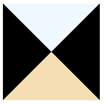
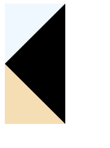

# css 画三角形


```html
<!DOCTYPE html>
<html lang="en">
<head>
    <meta charset="UTF-8">
    <meta name="viewport" content="width=device-width, initial-scale=1.0">
    <title>Document</title>
    <style>
        #sanjiaoxing {
            width: 0;
            height: 0;
            border: 100px solid black;
            border-top-color: aliceblue;
            border-bottom-color: wheat;
        }
    </style>
</head>
<body>
    <div id="sanjiaoxing"></div>
</body>
</html>
```



也就是说无宽高但有border时，border就是三角形


直角三角形：去掉左或右border

```html
#sanjiaoxing {
    width: 0;
    height: 0;
    border: 100px solid black;
    border-top-color: aliceblue;
    border-bottom-color: wheat;
    border-left: none;
}
```




多出来的border可以设置为透明即可
