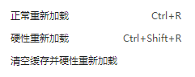
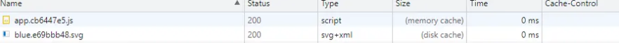
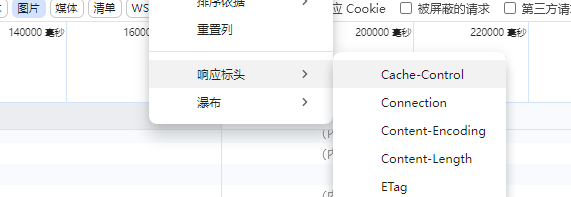
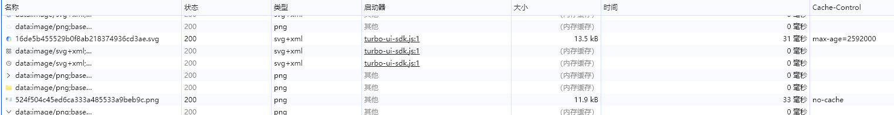

[toc]

# 浏览器缓存

缓存的优势

> 减少请求次数, 降低服务器压力
>
> 页面加载速度更快, 提高用户体验

右键浏览器刷新按钮可以看到三种重载页面方式(打开f12后右键刷新按钮-chrome)



## 浏览器三种加载方式

### 正常重新加载

方法：

> 地址栏回车
>
> 页面链接跳转
>
> 打开新窗口/标签页
>
> history前进后退
>
> 点击刷新按钮
>
> 页面右键重新加载
>
> F5
>
> ctrl+R

执行上面这些刷新操作，如果缓存不过期，会使用缓存。

这样浏览器可以避免重新下载JavaScript文件，图像，文本文件等，直接读取缓存信息。

### 硬性重新加载

方法：

> 点击硬性重新加载
>
> Ctrl+F5
>
> Ctrl+Shift+R

执行上面这些刷新操作，清除了关键位置的缓存；

所有的资源，都会跳过缓存判断，发起真实的请求，从服务端拿资源。

但**本地的缓存资源(如disk里的缓存)并没有删除**。

这种方式会在Request Header里添加**Cache-Control:no-cache**和**Pragma: no-cache**，也是浏览器自己的行为

### 清空缓存并硬性重新加载

方法：

> 点击左上角的清空缓存并硬性重新加载

这种方式，相当于先删除缓存（如 disk磁盘 和 memory内存 里的缓存），再执行硬性重新加载。

## 浏览器缓存位置

url中输入

> chrome://version

可以查看**个人资料路径**

## 请求资源策略

如何查看资源是使用的什么缓存?

f12 -> network



size列:

> memory cache: 内存缓存
>
> disk cache: 磁盘缓存

cache-control列可以查看缓存策略的配置, 没有说明走的浏览器的默认缓存设置 (启发式缓存)

如果没有这列可以随便右键一列的列头



选择 响应标头 -> cache-control 即可



## 启发式缓存

缓存的默认行为（即对于没有 Cache-Control 的响应）不是简单的“不缓存”，而是根据所谓的 `启发式缓存` 进行隐式缓存。

例如如下响应

```
HTTP/1.1 200 OK
Content-Type: text/html
Content-Length: 1024
Date: Tue, 22 Feb 2022 22:22:22 GMT
Last-Modified: Tue, 22 Feb 2021 22:22:22 GMT

<!doctype html>
...
```

> **缓存时间** = (date - LastModified)  \* 0.1

这里的这两个时间是决定下次刷新页面之后，是请求服务器还是走本地缓存的关键因素，**注意是下一次请求**！

MDN：

> 试探性地知道，整整一年没有更新的内容在那之后的一段时间内不会更新
>
> 因此，客户端存储此响应（尽管缺少 max-age）并重用它一段时间。复用多长时间取决于实现，但规范建议存储后大约 10%（在本例中为 0.1 年）的时间。

也就是说，如果十天没有更新的资源，会缓存一天的时间，在这段时间内浏览器请求走的都是本地缓存，超出这个时间则向服务器请求资源。

注意:

> 1 如上原理，在 Last-Modified （文件最后修改时间）不变的前提下，随着时间的推移，该资源缓存的时间会越来越长~
>
> 2 在缓存期间, 如果不强制刷新, 会拿不到最新的内容, 这可能导致一些问题的发生, 所以尽量只将一些 `不太重要`的东西进行缓存/不设置cache-control走默认策略

## Cache-Control

在HTTP/1.1中，`Cache-Control`是最重要的规则，主要用于控制网页缓存

### 请求指令

```
Cache-Control: max-age=<seconds>
Cache-Control: max-stale[=<seconds>]
Cache-Control: min-fresh=<seconds>
Cache-control: no-cache
Cache-control: no-store
Cache-control: no-transform
Cache-control: only-if-cached
```

### 响应指令

```
Cache-control: must-revalidate
Cache-control: no-cache
Cache-control: no-store
Cache-control: no-transform
Cache-control: public
Cache-control: private
Cache-control: proxy-revalidate
Cache-Control: max-age=<seconds>
Cache-control: s-maxage=<seconds>
```

### 扩展指令

拓展缓存指令不是核心 HTTP 缓存标准文档的一部分，使用前请注意检查兼容性

```
Cache-control: immutable
Cache-control: stale-while-revalidate=<seconds>
Cache-control: stale-if-error=<seconds>
```

### 指令含义

#### Cache-control: public

> 表明响应可以被任何对象（包括：发送请求的客户端，代理服务器，等等）缓存，即使是通常不可缓存的内容。
>
> （例如：1.该响应没有 `max-age`指令或 `Expires`消息头；2. 该响应对应的请求方法是 [POST](https://developer.mozilla.org/zh-CN/docs/Web/HTTP/Methods/POST) 。）

#### Cache-control: private

> 表明响应只能被单个用户缓存，不能作为共享缓存（即代理服务器不能缓存它）。
>
> 私有缓存可以缓存响应内容，比如：对应用户的本地浏览器。

#### Cache-control: no-cache

> 在发布缓存副本之前，强制要求缓存把请求提交给原始服务器进行验证 (协商缓存验证)。

#### Cache-control: no-store

> 缓存不应存储有关客户端请求或服务器响应的任何内容，即不使用任何缓存。

#### Cache-Control: max-age=`<seconds>`

> 设置缓存存储的最大周期，超过这个时间缓存被认为过期 (单位秒)。
>
> 与 `Expires`相反，时间是相对于请求的时间。

#### Cache-control: s-maxage=`<seconds>`

> 覆盖 `max-age`或者 `Expires`头，但是仅适用于共享缓存 (比如各个代理)，私有缓存会忽略它。

#### Cache-control: must-revalidate

> 一旦资源过期（比如已经超过 `max-age`），在成功向原始服务器验证之前，缓存不能用该资源响应后续请求。

#### Cache-control: proxy-revalidate

> 与 must-revalidate 作用相同，但它仅适用于共享缓存（例如代理），并被私有缓存忽略。

#### Cache-control: no-transform

> 不得对资源进行转换或转变。`Content-Encoding`、`Content-Range`、`Content-Type`等 HTTP 头不能由代理修改。
>
> 例如，非透明代理或者如[Google&#39;s Light Mode](https://support.google.com/webmasters/answer/6211428?hl=en)可能对图像格式进行转换，以便节省缓存空间或者减少缓慢链路上的流量。`no-transform`指令不允许这样做。

#### 分割线----请求独有：

#### Cache-Control: max-stale[=`<seconds>`]

表明客户端愿意接收一个已经过期的资源。可以设置一个可选的秒数，表示响应不能已经过时超过该给定的时间。

#### Cache-Control: min-fresh=`<seconds>`

表示客户端希望获取一个能在指定的秒数内保持其最新状态的响应。

#### Cache-control: no-transform

不得对资源进行转换或转变。Content-Encoding、Content-Range、Content-Type等 HTTP 头不能由代理修改。

例如，非透明代理或者如Google's Light Mode可能对图像格式进行转换，以便节省缓存空间或者减少缓慢链路上的流量。no-transform指令不允许这样做。

#### Cache-control: only-if-cached

表明客户端只接受已缓存的响应，并且不要向原始服务器检查是否有更新的拷贝。

#### 分割线----扩展指令：

#### stale-while-revalidate=`<seconds>`

表明客户端愿意接受陈旧的响应，同时在后台异步检查新的响应。秒值指示客户愿意接受陈旧响应的时间长度。

#### stale-if-error=`<seconds>`

表示如果新的检查失败，则客户愿意接受陈旧的响应。秒数值表示客户在初始到期后愿意接受陈旧响应的时间。

#### immutable

表示响应正文不会随时间而改变。资源（如果未过期）在服务器上不发生改变.

因此客户端不应发送重新验证请求头（例如 `If-None-Match`或 I `f-Modified-Since`）来检查更新，即使用户显式地刷新页面。

在 Firefox 中，immutable 只能被用在 `https://` transactions.

## 该请求头不同值对应的几种缓存类型

### 强缓存

```
Cache-Control : max-age=10086
```

`max-age=10086`：表示强缓存，服务器直接告诉浏览器10086秒不要来烦我，你直接从本地缓存获取资源吧；

如果是硬性重新加载，浏览器则表示：我就要向你服务器重新获取资源，你能咋滴吧，不还得乖乖返回给我（bushi）；

### 协商缓存

```
Cache-Control: no-cache
```

表示协商缓存，每次请求还是会和服务器去比对资源有没有修改（也就是拿ETag或者Last-Modified进行比较）：

> 如果资源没改变，则直接返回304状态码（Not Modified），说明无需再次传输请求的内容，也就是说可以使用缓存的内容；
>
> 如果资源改变，则返回200状态码，并且返回新的资源

这个方式等同于如下方式

```
Cache-Control: max-age=0,must-revalidate
```

这是为了兼容http/1.1之前的许多实现无法处理no-cache的情况

> `注意` 为确保默认情况下始终传输最新版本的资源，通常的做法是让默认的 Cache-Control 值包含 no-cache

### 不缓存

```
Cache-Control : no-store
```

`no-store`：表示不缓存，浏览器自带的启发式缓存都不生效了，慎用！

你可能认为添加 no-store 只是不进行强缓存和协商缓存了。

但是，连浏览器自带的启发式缓存策略都没了，所以不建议随意授予 no-store，因为你失去了 HTTP 和浏览器所拥有的许多优势，包括浏览器的后退/前进缓存。

因此，要获得 Web 平台的全部功能集的优势，最好不要轻易设置 no-store。

## get与post请求的缓存特性

### get

#### 可缓存性

默认情况下，GET请求被认为是安全的且幂等的，这意味着多次请求具有相同的效果，不会改变服务器状态。

因此，大多数浏览器和代理服务器会自动缓存GET请求的响应，特别是当响应包含合适的缓存控制头（如Cache-Control, Expires, ETag, 或 Last-Modified）时。

这样可以减少网络流量，加速后续相同请求的处理。

#### 浏览器历史与书签

由于GET请求的参数直接出现在URL中，它们可以被保存在浏览器的历史记录中，也可以被用户添加为书签。

这也意味着，如果一个GET请求的响应被缓存了，用户可以通过书签或历史记录直接访问到这个缓存的版本，而无需再次向服务器发送请求。

### post

#### 默认不缓存

与GET不同，POST请求通常用于提交数据到服务器，可能会导致服务器状态的改变（比如添加一条新的记录）。

因为这种潜在的副作用，HTTP规范默认建议不对POST请求的响应进行缓存，除非明确通过HTTP头部（如Cache-Control设置为public）指示它可以被缓存。

即便如此，实现对POST请求的缓存也较为少见，因为这**需要更细致地管理缓存策略以避免一致性问题**。

#### 安全性考虑

POST请求的数据不在URL中，而是放在请求体里，这使得它们不适合被缓存或保存在浏览器历史中，从而保护了敏感信息不被无意泄露。

## 本章参考

[[1] mdn-Cache-Control](https://developer.mozilla.org/zh-CN/docs/Web/HTTP/Headers/Cache-Control "mdn对Cache-Control的介绍")

[[2] 带你彻底了解浏览器缓存！](https://blog.csdn.net/qq_42205731/article/details/139055005 "csdn-陨石猎人-带你彻底了解浏览器缓存！")

[[3] get和post请求在缓存方面的区别](https://blog.csdn.net/weixin_46730573/article/details/140505944 "csdn-GIS-CL-前端面试题79（get和post请求在缓存方面的区别）")

---

# cookie、session 与 token

## cookie


### 主要流程

使用 cookie 进行用户确认流程是比较简单的，大致分为以下几步：

1.客户端发送请求到服务端（比如登录请求）。

2.服务端收到请求后生成一个 session 会话。

3.服务端响应客户端，并在响应头中设置 Set-Cookie。Set-Cookie 里面包含了 sessionId，它的格式如下：

其中 sessionId 就是用来标识客户端的

4.客户端收到该请求后，如果服务器给了 Set-Cookie，那么下次浏览器就会在请求头中自动携带 cookie。

5.客户端发送其它请求，自动携带了 cookie，cookie 中携带有用户信息等。

6.服务端接收到请求，验证 cookie 信息，比如通过 sessionId 来判断是否存在会话，存在则正常响应。

### 规范

* Cookie大小上限为4KB；
* 一个服务器最多在客户端浏览器上保存20个Cookie；
* 一个浏览器最多保存300个Cookie 面的数据是HTTP对Cookie的规范，但是现在一些浏览器可能会对Cookie规范 做了一些扩展，例如每个Cookie的大小为8KB，最多可保存500个Cookie等
* 不同的浏览器之间是不共享Cookie的

### 语法

```
Set-Cookie: <cookie-name>=<cookie-value>
Set-Cookie: <cookie-name>=<cookie-value>; Domain=<domain-value>
Set-Cookie: <cookie-name>=<cookie-value>; Expires=<date>
Set-Cookie: <cookie-name>=<cookie-value>; HttpOnly
Set-Cookie: <cookie-name>=<cookie-value>; Max-Age=<number>
Set-Cookie: <cookie-name>=<cookie-value>; Partitioned
Set-Cookie: <cookie-name>=<cookie-value>; Path=<path-value>
Set-Cookie: <cookie-name>=<cookie-value>; Secure

Set-Cookie: <cookie-name>=<cookie-value>; SameSite=Strict
Set-Cookie: <cookie-name>=<cookie-value>; SameSite=Lax
Set-Cookie: <cookie-name>=<cookie-value>; SameSite=None; Secure

// 可以同时有多个属性，例如：
Set-Cookie: <cookie-name>=<cookie-value>; Domain=<domain-value>; Secure; HttpOnly
```

### 属性

Set-Cookie: cookieName=cookieValue

注意是字符串且使用的是ASCII字符集

#### domain=domainValue `可选`

指定 cookie 可以送达的主机。

只能将值设置为当前域名或更高级别的域名（除非是公共后缀）。设置域名将会使 cookie 对指定的域名及其所有子域名可用。

`若缺省，则此属性默认为当前文档 URL 的主机`（不包括子域名）。

与之前的规范不同，域名（`.example.com`）的前导点号会被忽略。即现在不需要加点符号了, 以前是例如 `.baidu.com`

多个主机/域名的值是*不*被允许的，但 `如果指定了一个域名，则其子域名也总会被包含`。

#### Expires=date	`可选` `date`

以 HTTP 日期时间戳形式指定的 cookie 的最长有效时间。参见 [date](https://developer.mozilla.org/zh-CN/docs/Web/HTTP/Headers/Date "date详情") 以了解要求的格式。

如果没有指定，那么会是一个 `会话期 cookie`。会话在客户端被关闭时结束，这意味着会话期 cookie 会在彼时被移除。

```
警告：然而，很多 Web 浏览器支持会话恢复特性，这可以使浏览器保留所有的标签，然后在重新打开浏览器的时候将其还原。与此同时，cookie 也会恢复，就跟从来没有关闭浏览器一样。
```

如果设置了 `Expires` 日期，其截止时间与*客户端*相关，而非服务器的时间。

#### HttpOnly `可选`

阻止 JavaScript 通过 [`Document.cookie`](https://developer.mozilla.org/zh-CN/docs/Web/API/Document/cookie) 属性访问 cookie。

> 注意，设置了 `HttpOnly` 的 cookie 仍然会通过 JavaScript 发起的请求发送。

例如，调用 [`XMLHttpRequest.send()`](https://developer.mozilla.org/zh-CN/docs/Web/API/XMLHttpRequest/send) 或 [`fetch()`](https://developer.mozilla.org/zh-CN/docs/Web/API/Window/fetch)。其用于防范跨站脚本攻击（[XSS](https://developer.mozilla.org/zh-CN/docs/Glossary/Cross-site_scripting)）。

#### Max-Age `可选` `number`

在 cookie 过期之前需要经过的秒数。秒数为 0 或负值将会使 cookie 立刻过期。

> 🤺注意: Max-Age的优先级大于 Expires, 即如果同时设置了 `Max-Age`和 `Expires`时, 会以 `Max-Age`为准

#### Path=pathValue `可选`

表示浏览器要发送该 `Cookie` 标头时，请求的 URL 中所*必须*存在的路径。

正斜杠（`/`）字符可以解释为目录分隔符，且子目录也满足匹配的条件。例如，如果 `path=/docs`，那么

* 请求路径 `/docs`、`/docs/`、`/docs/Web/` 和 `/docs/Web/HTTP` 都满足匹配条件。
* 请求路径 `/`、`/docsets` 或者 `/fr/docs` 则不满足匹配条件。

#### SameSite=samesite-value **`可选`**

控制 cookie 是否随跨站请求一起发送，这样可以在一定程度上防范跨站请求伪造攻击（[CSRF](https://developer.mozilla.org/zh-CN/docs/Glossary/CSRF)）。

可选的属性值有：

##### Strict

这意味浏览器仅对同一站点的请求发送 cookie，即请求来自设置 cookie 的站点。

如果请求来自不同的域名或协议（即使是相同域名），则携带有 `SameSite=Strict` 属性的 cookie 不会被发送。

##### Lax

这意味着 cookie 不会在跨站请求中被发送，如：加载图像或框架（frame）的请求。

但 cookie 在用户从外部站点导航到源站时，cookie 也会被发送（例如，访问一个链接）。这是 `SameSite` 属性未被设置时的默认行为。

##### None

这意味着浏览器在跨站和同站请求中均会发送 cookie。在设置这一属性值时，必须同时设置 `Secure` 属性，就像这样：`SameSite=None; Sddecure`。如果未设置 `Secure`，则会出现以下错误：

```
Cookie "myCookie" rejected because it has the "SameSite=None" attribute but is missing the "secure" attribute.

This Set-Cookie was blocked because it had the "SameSite=None" attribute but did not have the "Secure" attribute, which is required in order to use "SameSite=None".
```


#### Secure `可选`

表示仅当请求通过 `https:` 协议（localhost 不受此限制）发送时才会将该 cookie 发送到服务器，因此其更能够抵抗[中间人](https://developer.mozilla.org/zh-CN/docs/Glossary/MitM)攻击。


```
🌟备注：
不要假设 Secure 会阻止所有的对 cookie 中敏感信息（会话密钥、登录信息，等等）的访问
携带这一属性的 cookie 在不设置 HttpOnly 属性的情况下仍能从客户端的硬盘或是从 JavaScript 中访问及更改。

非安全站点（http:）不能在 cookie 中设置 Secure 属性（从 Chrome 52 和 Firefox 52 开始）
当 Secure 属性由 localhost 设置时，https: 的要求会被忽略（从 Chrome 89 和 Firefox 75 开始）
```


常用api

**cookie 主要有以下特点：**

* cookie 存储在客户端
* cookie 不可跨域，但是在如果设置了 domain，那么它们是可以在一级域名和二级域名之间共享的

总结

1. c端发送请求到s端
2. s端收到后生产session会话
3. s端响应客户端，并在set-cookie头中设置cookie，其同时携带有sessionId
4. 客户端收到该请求后，如果服务器给了 Set-Cookie，那么下次浏览器就会在请求头中自动携带 cookie。
