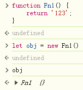
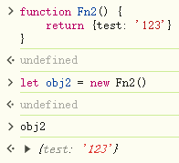
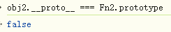
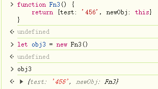
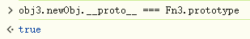
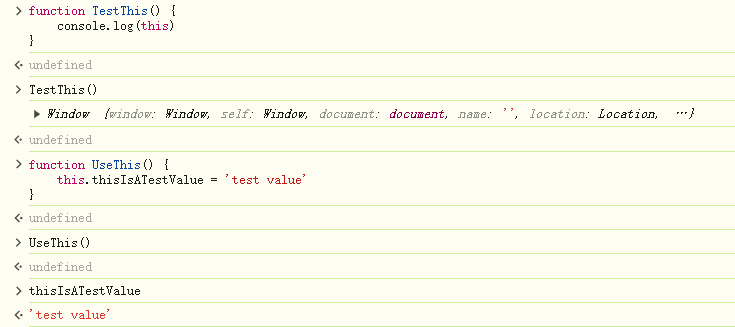
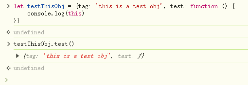

# 数据类型


## null


## undefined


## number

包括NaN


## string


## boolean


## Symbol


## BigInt


# new操作符


new操作符其实就干了三件事

```js
const obj = {};

// 假设new操作语句为：const myObj = new MyClass()
obj.__proto__ = MyClass.prototype;

MyClass.call(obj)
```

在第三步 `MyClass.call(obj)`的MyClass方法中，this便是指向了这个新的对象的，故而class中的this.XXX便相当于在这个新对象上新增属性


## 构造方法|类的构造器方法中的return


### 如果return的是个基本变量



可见，字符串123会被忽略，而返回new操作符自己生成的新对象


### 返回引用类型



则new操作符生成的对象将被忽略而返回return语句返回的对象

---




那么自然return出来的对象的原型不会是Fn2的原型对象


---

我们可以尝试在return的对象中加入this：





可以看到方法中的this也就是new生成的


## 方法中的this

当方法不作为构造函数时



可见this指向调用该方法的对象




这真滴会有点奇怪，为啥方法的this不指向方法的原型对象嘞哈哈哈哈，不过指向原型对象了的话，那其实会乱套，公共的东西（原型对象一般放公共方法）被莫名其妙的修改了


对这里的原型如有疑惑请移步原型链
