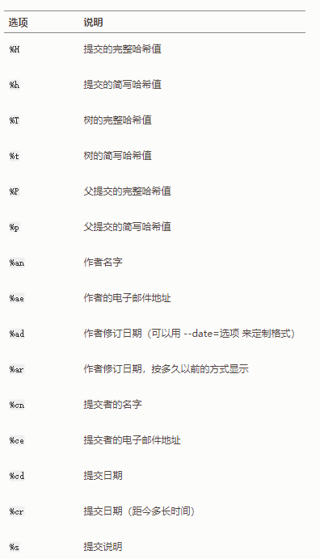

# 查看历史提交

> git log  
> 会按时间先后顺序列出所有的提交，最近的更新排在最上面  

> git log 有许多选项可以帮助你搜寻你所要找的提交，   
> 下面我们会介绍几个最常用的选项。  
> ...
> git log -p  或 git log --patch 
> 它会显示每次提交所引入的差异  
> 你也可以限制显示的日志条目数量，例如使用 -2 选项来只显示最近的两次提交
> git log -p -2 
> 该选项除了显示基本信息之外，还附带了每次提交的变化。   
> 当进行代码审查，或者快速浏览某个搭档的提交所带来的变化的时候，这个参数就非常有用了  


> 你也可以为 git log 附带一系列的总结性选项。  
> 比如你想看到每次提交的简略统计信息，可以使用 --stat 选项：  
> --stat 选项在每次提交的下面列出所有被修改过的文件、  
> 有多少文件被修改了以及被修改过的文件的哪些行被移除或是添加了。   
> 在每次提交的最后还有一个总结

> 另一个非常有用的选项是 --pretty。   
> 这个选项可以使用不同于默认格式的方式展示提交历史  
>  这个选项有一些内建的子选项供你使用。   
> 比如 oneline 会将每个提交放在一行显示，  
>  另外还有 short，full 和 fuller 选项，  
> 它们展示信息的格式基本一致，但是详尽程度不一  
>  git log --pretty=oneline

> 最有意思的是 format ，可以定制记录的显示格式。   
> 这样的输出对后期提取分析格外有用——因为你知道输出的格式不会随着 Git 的更新而发生改变  
> 例如:  
> git log --pretty=format:"%h - %an, %ar : %s"  
>   
>  作者指的是实际作出修改的人，提交者指的是最后将此工作成果提交到仓库的人


> 当 oneline 或 format 与另一个 log 选项 --graph 结合使用时尤其有用。   
> 这个选项添加了一些 ASCII 字符串来形象地展示你的分支、合并历史  
> 例如: 


```  
$ git log --pretty=format:"%h %s" --graph  
* 2d3acf9 ignore errors from SIGCHLD on trap   
*  5e3ee11 Merge branch 'master' of git://github.com/dustin/grit
|\
| * 420eac9 Added a method for getting the current branch.
* | 30e367c timeout code and tests
* | 5a09431 add timeout protection to grit
* | e1193f8 support for heads with slashes in them
|/
* d6016bc require time for xmlschema
*  11d191e Merge branch 'defunkt' into local  
```


## 限制输出长度

> git log有许多限制输出长度的选项  
> 如之前的-2,其实可以类似 -n,n为任何证书,只显示最近的n条提交  
> 这个选项不是很常用，因为 Git 默认会将所有的输出传送到分页程序中，所以你一次只会看到一页的内容  

> 类似 --since 和 --until 这种按照时间作限制的选项很有用  
> 如下列出最近两周的所有提交  
> git log --since=2.weeks  
> 该命令可用的格式丰富  如:  
> 类似"2008-01-15"的具体某一天  
> 也可以类似"2 years 1 day 3 minutes age"的相对日期  


> 还可以过滤出匹配指定条件的提交-  
> 使用--author选项显示指定作者的提交  
> 使用--grep选项搜索提交说明中的关键字  

> *** 你可以指定多个 --author 和 --grep 搜索条件，这样会只输出 任意 匹配 --author 模式和 --grep 模式的提交。然而，如果你添加了 --all-match 选项， 则只会输出 所有 匹配 --grep 模式的提交。 ***

### -S过滤器

俗称pickaxe选项,取"用鹤嘴锄在土里捡石头"之意  
接受一个字符串参数,只会显示哪些添加或删除了该字符串的提交  

假设你想找出添加或删除了对某一个特定函数的引用的提交，可以调用：  
git log -S function_name  

常用选项:  
