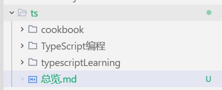
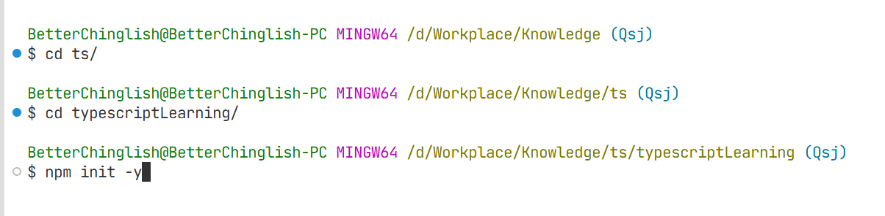
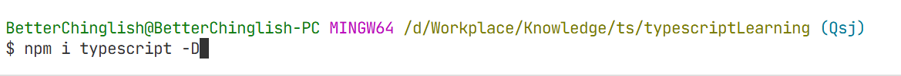
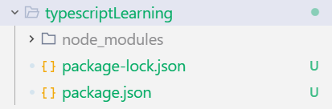
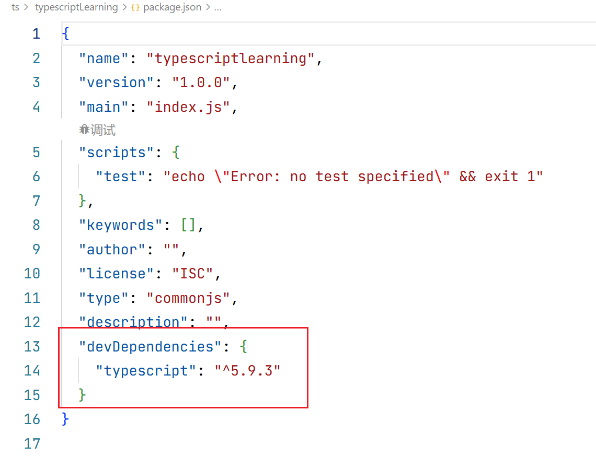
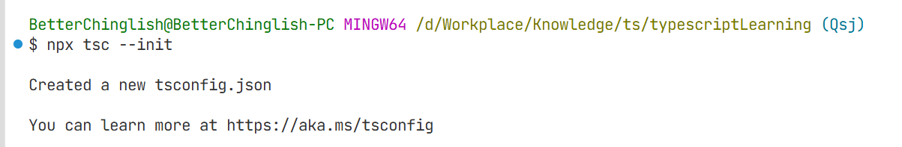
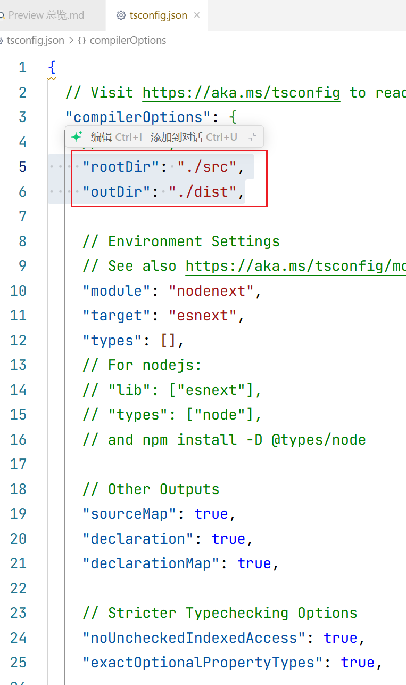

# 环境搭建

新建文件夹typescriptLearning


进入文件夹typescriptLearning，初始化项目

```bash
cd typescriptLearning
npm init -y
```



安装typescript

```bash
npm install typescript --save-dev
```



查看目录文件


可以打开package.json文件，查看typescript的版本


初始化typescript配置文件

```bash
npx tsc --init
```


tsconfig.json打开配置
```json
{
  "compilerOptions": {
    "rootDir": "./src",
    "outDir": "./dist",
  }
}
```



# 类型

## 类型注解
```typescript
// 类型注解
let age: number = 18;
```

## 类型推导
```typescript
// 类型推导
let fullName = '张三';
```
## const声明中类型推导的缩窄
如下代码,这里schoolName的类型会被typescript定义为'清华大学'而非string

```typescript
// const类型推导的缩窄
const schoolName = '清华大学';
```
这是因为const声明的变量是不可重新赋值的,所以typescript会将其类型推导为字面量类型,而不是string类型。

## any

## unknow

## boolean

## number

## bigint

## string

## symbol

## 对象

### Object

### object

### {}

## 数组

## 元组

## null

## undefined

## void

## never

## 枚举

### 数字枚举

### 字符串枚举

### 数字枚举的双重映射

## 类型别名、并集与交集

# 函数

# 类与接口

# 处理错误

# 异步、并发、并行

# 命名空间与模块
