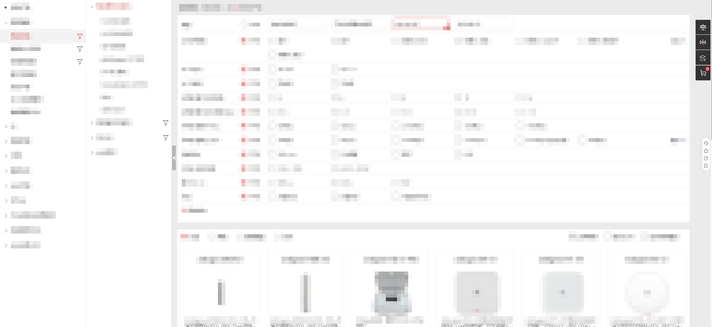

[toc]

# something about working for Huawei-SCT

## 前言

再有一周时间，便是来华为做sct一周年了，上周末写了点开发路上遇到的问题以及对应的解决措施的总结

但其间我始终有种念头，是不是真的我不太行。

sct是华为的智能报价工具，处于整个业务承上启下的重要节骨眼上

上面是各种产品、机会点什么的基本盘，下面面向各种不同客户，sct准确点来说是UniSTAR SCT，sct即为smart configuration tool，我们更喜欢称其为智能配置报价工具，即便英文名没有报价之意

其实从名字上也大概猜出sct是干什么的了，简单点说就是选产品、配配置、生成报价单，然后最后拿去竞标呗。

光从这里听上去确实很简单，我刚毕业都能做出一个简单的购物商场的，既然是购物的那还不是异曲同工？

起初，我也是这样认为的，但事情往往不向预期发展

## 为何复杂

第一次看sct网站，还是导师教我们起工程、顺带简介我们的主网

那时只是简单讲了下我们组负责的模块，我并不觉得有多难，但当培训结束后我自己点开网站时，便发现事情没有那么简单。

既然是类似商城的玩意，那肯定先看产品咯。

### 产品列表

点开产品一看，怎么说呢，产品类别就挺多的了，左边slide两棵树选择产品族、产品线、产品系列，右边主要内容区域分为top，filter，和content，top也是选择类型，filter则是根据条件过滤，content显示最终产品。

这么乍一听好像也不难，确实，但如果我说不同的产品族、产品线、产品系列的top、filter可能不同呢？

简单贴个图吧

最左边的那棵树，也就是产品族，可以理解为华为不同事业部，产品线则是不同类别的产品，产品系列类似mate系列与p系列的区别

其实到这里可见一斑了，但其实这是最简单的页面之一，因为分支结构并不复杂，也只有固定的几个层级，只是多而已。

但是想想这里还有产品对比功能，点进去还有产品详情，不同类型的产品的显示结构也可能不同；显示的模块也不同；甚至在不同国家下，模块显示与否也不同；加入购物车的校验也不同，包括前端校验和后端校验；

好，这是最简单的一个产品列表而已。

接下来我们看看产品配置

### 产品配置

随便点一个产品进入产品详情，这里就有产品配置，可能难度跨越的有点大

这里就不放图了，简单说一下吧，这里的产品我指的是设备，sct基本上面向的是运营商和大企业客户，一个产品类似于最简单的路由器，包括了基本配置、电源、光模块、光电缆、辅料、附件

也就是说，基本上一个路由器从头到尾你可以选配，从用的什么线，到路由器使用的软件，有些产品的参数设置能有数百行

而这数百行又可能有冲突，比如某种规格选了a，另外的规格的可选项就会随之改变；或是某种规格选了b，一些c、d规格就不能选这样

而购物车只是暂存选了的产品的，最终目的是生成报价单，选择产品生成报价单，或是报价单添加产品，一个报价单可能有多个产品，而多个产品之间也可能有冲突（不过这就涉及另外一种报价单了，叫做解决方案）

为了解决这些冲突，有专门的算法团队对这些进行处理，为每种产品生成算法包，但是前端表格还是很复杂。一个表格的cellType（类实现）能继承四五层。

而且，产品配置页面的表格需要支持多种情况，可能不同国家、不同类型的报价单、不同领域的产品、不同场景进入可能都有不同。

不同国家、不同类型的报价单什么的进来可能不同可以理解，不同场景进来又是什么意思？可编辑和只读场景？并不只是这点，这还得从他的架构说起

### 微组件架构

华为将带有业务逻辑的组件成为微组件，与微前端不同，微组件是为了复用各种组件，以此保留原事业部现有代码，以便接入erp便于管理，微组件架构依赖基座运行时环境，统一的环境配置能够使得不同事业部的组件能够在不同的地方进行复用，这又是因为客户有一定的技术能力，能够按照自己的需求打造自己的页面，也就是不同的业务组件（微组件），通过统一的平台（灵雀-类低代码平台）进行编排形成新的页面，其实提供给客户的就是所谓的组件与元数据接口。

类似的，sct也有这样的操作，将组件打包后给其他团队在他们的页面上使用，这要求sct团队能够支持不同场景，不同场景也就是不同团队的不同的项目下，有一些特殊的逻辑存在。

## 捋一下需要控制的条件

如标题，让我们大致捋一下不完全统计的条件

> 国家
>
> 报价单情况
>
> 拟稿报价单与提交报价单-拟稿与发布
>
> 编辑与只读
>
> 一般报价单与解决方案报价单
>
> 产品类型与产品所属

如上是基础要控制的条件, 当你实现一个功能例如按钮是否可以点击, 可能本身存在基本的逻辑, 在这些逻辑之上你还要先看看我列出来的这些逻辑

## 额外导致复杂的

上面不同的boss都有一个相同的话题, 保障质量. 产品经理也说过, 项目年流水超千亿, 不要因为你的一个bug影响企业的报价导致错过竞标错过单子.

所以这个项目是即为重要的, 但是华为却选择了外包出去。而即便是如今，招的是od，带点愚蠢的压榨。

写的代码垃圾也就算了。更多是：

奇怪的实现逻辑, 没有注释的代码, 没有统一的规范，变量取名意义不清，工具方法使用混乱，功能使用混乱，没有业务完整的、可信的业务规范，没有接口文档，没有业务规格。

细的就不多说了，后面上总结的时候提到的规范自然就是这里遇到过的问题。

## 小插曲

在版本回顾会上，tl邀请我们踊跃发言，在第一次我提出放慢脚步、完善流程、优化细节、正向循环四个方面的计划。

### 放慢脚步

其实就是版本延长，留出更多的时间应对每一个环节

因为当时有对接的系统将一个月一版本改为了两个月，并在两个月内干不同的事情，一个是开发一个是发包，而原本这俩是一起的

结合当前团队情况，我觉得应该留出一两周时间，大家一起整理规格并归档等。

### 完善流程与优化细节

我认为目前团队急需要解决的就是规格的整理，其实就是现有资产的整理与自证，包括后续的维护。

开发时，经常遇到一个情况，对接的几个系统，这边来开发问页面上某一列取的是哪个接口的哪个数据

一会又来个对接系统的ba，问一些字段的处理情况

一会又来个测试，问具体规格

我：？

我啷个晓得具体情况，每次都是一个一个去找，一个一个去分析去看。

包括需求发下来的时候，ba来问我以前的规格，要我整理出来，这要是简单的规格倒还好，但这回我是遇到了产品配置页面一个极为复杂的东西，情况太多了，我看了两天代码，标记了注释了二十来个文件，看的文件更是不计其数。

其实这里说的感言已经是结合第二次版本回顾会上的内容了，当时并没有这层感受，上述情况也是第一次版本回顾会紧接着遇到的情况，但恰恰是第一次版本回顾会的补充。

前面也说了，我们没有接口文档，前端的，后端也是没有的，但是后端有白皮书，那玩意简单介绍了下用到的表和字段，在我看来意义不大。

在第二次版本回顾会上，我继续补充提出，接口文档结合串讲、反串进行，目的就是业务需求要求开发对接口进行改动，包括前后端的逻辑变更，我们应该将具体描述补充到接口文档中，这样后续有什么问题，就去看接口文档。

这也要求接口文档一些特殊的结构，比如说需要结合页面进行，如何结合前后端内容，如何归档上串讲、反串文档内容，甚至有详设的，也要归档上详设

这里可以单独出一期讨论如何实现这种东西。

回归正题，我们现在的流程是

> 用户提出需求、
>
> ba进行分析拆解成条目、
>
> ba讲给开发（串讲）、
>
> 开发结合自己理解讲讲要实现的点（开发反串）、
>
> 测试讲讲自己要测的点（测试反串）、
>
> 开发、
>
> 转测、
>
> 测试、
>
>> 有问题提bug单
>>
>> 有bug单提代码修改
>>
>> 测试
>>
>
> 完成

而串讲、反串时ba与开发产出的文档，都没有一个汇总，以前有，但没有时间维护了现在

以前有，也只是将文档简单的放在一起，并没有一个具体的规格汇总，可能不同人不同的需求只是一个文档，你根本无法根据这些文档去找某个地方具体的实现

而如果加一个步骤，就是将自己要改动的东西放到对应的接口上，并将ba、开发的文档作为变更接口前的强制要求，那么文档就不局限于文档了，而是将规格解套、分析、汇总到接口上，后续某个页面有什么问题，找对应组件的对应接口，看具体的逻辑，即可快速了解；而后续需求的开发，即便是新人，也可以阅读这个接口文档，快速上手，可谓极大程度上提高了效率。

###
